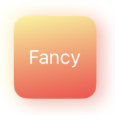

import Tabs from '@theme/Tabs';
import TabItem from '@theme/TabItem';

The main view component of Phaselis is the `Block` component. It can take linear gradient props to create dynamic, visually appealing designs.

## How it works

The `Block` component uses `react-native-linear-gradient` for gradients. You can pass gradient props to any `Block` component to enhance its style.


<Tabs defaultValue='preview'>
    <TabItem value="preview" label="Preview">
     
    </TabItem>
    <TabItem value="code" label="Code">
  
```jsx
import { Block } from 'phaselis';

{...}

<Block
    style={{
        width: 60,
        height: 60,
        borderWidth: 1,
        borderRadius: 10,
        justifyContent: "center",
        alignItems: "center",
        backgroundColor: "linear-gradient(to right, rgba(255,0,0,0), rgba(255,0,0,1))",
        }}
      >
    <Text style={{ color: "white" }}>Fancy</Text>

    {...}

 </Block>
```
    </TabItem>
</Tabs>

:::note
for more information about the about linear gradient props, please refer to the [LinearGradientProps](../advanced/interfaces/linear-gradient-interface) interfaces.